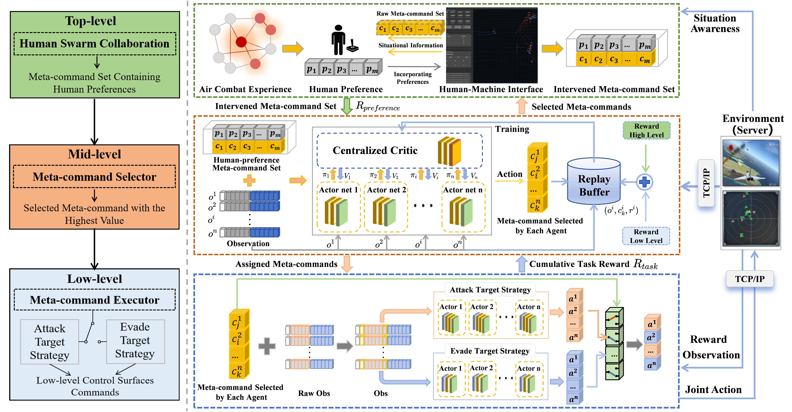
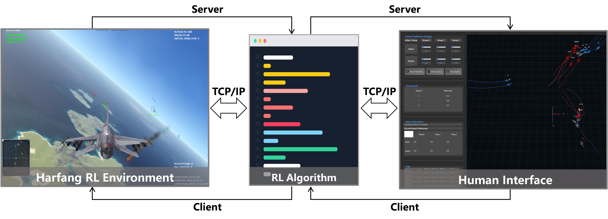
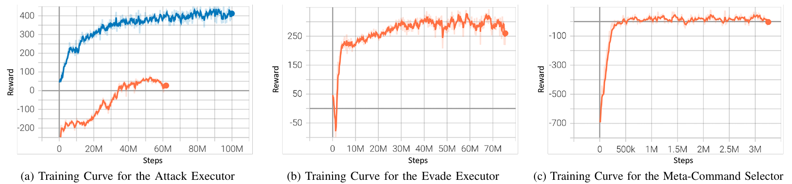
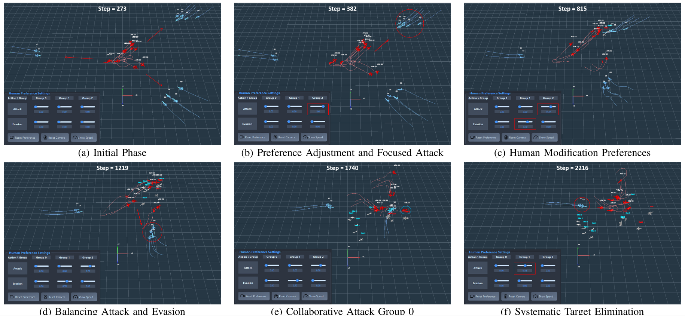

# H2CF
Hierarchical Human-Swarm Collaborative Framework

## Project Overview
This project implements H2CF, a hierarchical human-swarm collaborative framework that integrates human strategic intent with MARL to improve swarm adaptability in out-of-distribution (OOD) scenarios.

## Architecture
### Framework
H2CF employs a three-level architecture: (i) a top-level human-swarm interaction module that captures the human's strategic intent through an intuitive interface; (ii) a mid-level meta-command selector that employs a dynamic preference embedding mechanism to optimize command selection based on environmental observations and human preferences; and (iii) a bottom-level meta-command executor that translates meta-commands into distributed control actions using MARL for swarm coordination.



### Human-Swarm Interaction System
The figure below shows the human-swarm interaction system built on the Harfang platform. The left panel displays the Harfang simulation environment, the center presents the H2CF control algorithm, and the right panel shows the human-machine interface. Humans adjust meta-command preferences in real time via the interface to dynamically guide UAV swarm behavior.



## Repository Structure
- `Hsi_interface/`: Human-swarm interaction GUI (PyQt6/OpenGL).
- `Command_selector/`: Meta-command selector (mid-level).
- `Executor_attack/`: Meta-command executor for attack.
- `Executor_evade/`: Meta-command executor for evasion.
- `weights/`: Pretrained weights.

## Modules
- `Hsi_interface/` → [Hsi_interface/README.md](Hsi_interface/README.md)
- `Command_selector/` → [Command_selector/README.md](Command_selector/README.md)
- `Executor_attack/` → [Executor_attack/README.md](Executor_attack/README.md)
- `Executor_evade/` → [Executor_evade/README.md](Executor_evade/README.md)

## Quick Start
- Human-swarm interface: `python Hsi_interface/design_v16.py`
- Meta-command selector: `python Command_selector/scripts/train/train_harfang.py`
- Executor (attack): `python Executor_attack/scripts/train/train_harfang.py`
- Executor (evade): `python Executor_evade/scripts/train/train_harfang.py`
- Dependencies and environment setup vary by module; see each module README.

## Results



## Acknowledgements / References
Simulation backend is based on the Harfang3D Dog-Fight Sandbox. Please cite:

```bibtex
@misc{2210.07282,
  Author = {Muhammed Murat Özbek,  Süleyman Yıldırım,  Muhammet Aksoy, Eric Kernin and Emre Koyuncu},
  Title = {Harfang3D Dog-Fight Sandbox: A Reinforcement Learning Research Platform for the Customized Control Tasks of Fighter Aircrafts},
  publisher = {arXiv},
  doi = {10.48550/ARXIV.2210.07282},
  Year = {2022},
  Eprint = {arXiv:2210.07282},
}
```

## License
See `LICENSE`.
